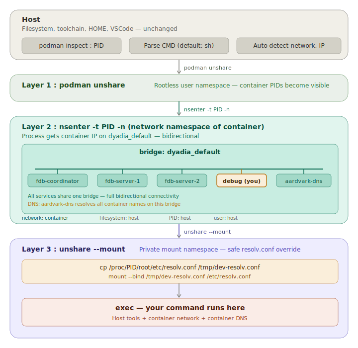

# container-shell.sh — Local dev inside compose network



## Problem

When running a service (backend richter, frontend heino, etc.) locally on the host for development:

- The process is **not on the compose network** — DNS names like `fdb-coordinator` don't resolve
- Containers **can't reach the dev process** — no IP on `dyadia_default` bridge
- You don't want to run inside a container — need host filesystem, toolchain, VSCode, etc.

## Solution

Use a **dummy pause container** (`debug` service in compose — `alpine/curl sh`) that holds a network namespace slot on the bridge. Then `nsenter` into its network namespace from the host, keeping everything else (filesystem, PID, user) on the host.

Any service that needs bidirectional connectivity with the compose network can use this script — not just the backend.

---

## 3-layer namespace stack

### Layer 1 — `podman unshare`

```sh
podman unshare <cmd>
```

Enters Podman's **rootless user namespace**. Required because in rootless mode, container PIDs are only visible inside this user namespace. Without this layer, `nsenter` can't find the target PID.

This layer does **not** change the network — it only makes container processes addressable.

---

### Layer 2 — `nsenter -t $PID -n`

```sh
nsenter -t $PID -n <cmd>
```

Switches **only the network namespace** to the target container's. The process now:

- Has the container's **IP address** on `dyadia_default` bridge
- Can send packets to any container on the bridge
- **Can be reached by** any container on the bridge (bidirectional)
- Still uses host filesystem, PID namespace, user namespace

Comparison with v1 (`podman unshare --rootless-netns`): v1 entered the rootless netns "above" the bridge — the process could see container IPs but had no IP of its own. Traffic was one-way only.

`nsenter` flags reference:

| Flag | Namespace | What changes |

|------|-----------|-------------|
| `-t PID` | target | Which process to copy namespaces from |
| `-n` | network | IP, routes, sockets, interfaces |
| `-m` | mount | Filesystem mounts (we do NOT use this — want host fs) |
| `-p` | PID | Process tree |
| `-U` | user | UID/GID mapping |

We only use `-n` to keep host filesystem and toolchain intact.

---

### Layer 3 — `unshare --mount` + bind `resolv.conf`

```sh
unshare --mount sh -c "
  cp /proc/$PID/root/etc/resolv.conf /tmp/dev-resolv.conf &&
  mount --bind /tmp/dev-resolv.conf /etc/resolv.conf &&
  exec \"\$@\"
" -- "${CMD[@]}"
```

Problem: Layer 2 changed the network but **not the mounts**. `/etc/resolv.conf` still points to the host's DNS server, which doesn't know container names.

Solution:

1. `unshare --mount` — create a **private mount namespace** so bind mounts don't affect the host
2. `cp /proc/$PID/root/etc/resolv.conf` — copy `resolv.conf` from the container's filesystem (accessible via `/proc/$PID/root/`)
3. `mount --bind` — overlay it on `/etc/resolv.conf`

Now DNS queries go through **aardvark-dns** (Podman's internal DNS), which resolves container names.

Why not use `nsenter -m` (mount namespace of container) instead? That would replace the **entire filesystem** with the container's — losing access to Go, Node, $HOME, and all host tools.

---

## DNS flow

``` text
app calls fdb-coordinator:4500
  → glibc reads /etc/resolv.conf (bind-mounted from container)
  → nameserver = aardvark-dns (gateway of dyadia_default)
  → aardvark-dns resolves fdb-coordinator → 10.89.0.2
  → TCP connect through dyadia_default bridge
  → fdb-coordinator receives connection
```

## Reverse flow (container → dev process)

``` text
container runs: curl http://debug:8080
  → aardvark-dns resolves debug → 10.89.0.5
  → packet goes through dyadia_default bridge
  → arrives at debug's netns veth
  → dev process (sharing debug's netns) receives it
```

---

## Compose service

```yaml
debug:
  image: alpine/curl
  tty: true
  stdin_open: true
  command: sh
```

This container holds a network namespace slot with an IP on the bridge. The actual dev process runs on the host via `container-shell.sh`.

---

## Usage

```sh
# Open a sh shell in the compose network (uses debug service by default)
./scripts/setup/environment.dev/container-shell.sh

# Run richter (Go backend) directly
./scripts/setup/environment.dev/container-shell.sh -- go run ./cmd/richter/...

# Run heino (frontend) directly
./scripts/setup/environment.dev/container-shell.sh -- npm run dev

# Use a different service's namespace (pass service name, not full container name)
./scripts/setup/environment.dev/container-shell.sh richter -- go run ./...
```

---

## What you keep vs what changes

| Aspect | Source | Example |

|--------|--------|---------|
| Filesystem | Host | `/home/user`, Go/Node toolchain, VSCode |
| Network | Container (debug) | IP on `dyadia_default`, routes |
| DNS | Container (resolv.conf) | aardvark-dns resolves container names |
| PID | Host | `ps` shows host processes |
| User | Host | Same UID, same `$HOME` |

---

## Script

[container-shell.sh](../scripts/setup/environment.dev/container-shell.sh)
