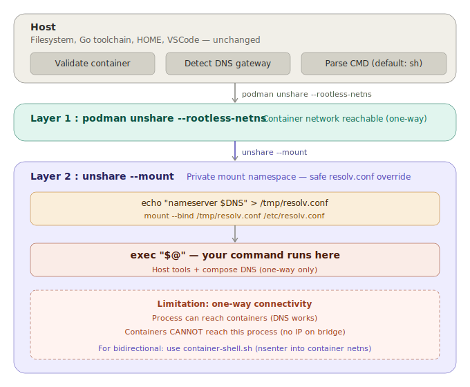

# dev-shell.sh — Local dev with compose DNS (one-way)



## Problem

When running an app on the host:

- App is **not in the compose network** — DNS names like `fdb-coordinator` don't resolve
- `/etc/resolv.conf` points to host DNS, not Podman's `aardvark-dns`

## Solution

Enter Podman's **rootless network namespace** and override `resolv.conf` to point at `aardvark-dns`.

> **Note:** This approach is **one-way** — the host process can reach containers, but containers cannot reach the host process. For bidirectional connectivity, see [ContainerShell.md](./ContainerShell.md).

---

## 3-layer namespace stack

### Layer 1 — `podman unshare --rootless-netns`

```sh
podman unshare --rootless-netns <cmd>
```

Enters Podman's **rootless network namespace** — where the `dyadia_default` bridge and container IPs are reachable.

Without this layer: host shell can't see the container network, connections to `10.89.x.x` fail.

---

### Layer 2 — `unshare --mount`

```sh
unshare --mount sh -c "..."
```

Creates a **private mount namespace**. Allows bind mounting `/etc/resolv.conf` without affecting the host or other processes.

Without this layer: `mount --bind` on `/etc/resolv.conf` would overwrite the host's file.

---

### Layer 3 — override `resolv.conf` + exec

```sh
echo "nameserver $DNS" > /tmp/resolv.conf
mount --bind /tmp/resolv.conf /etc/resolv.conf
exec "$@"
```

`$DNS` is the **gateway IP** of `dyadia_default` — the address of `aardvark-dns`, Podman's internal DNS resolver.

After the bind mount, all DNS queries go through `aardvark-dns` and resolve container names.

---

## How DNS gateway is determined

```sh
DNS=$(podman network inspect dyadia_default \
  --format '{{range .Subnets}}{{.Gateway}}{{end}}' | head -1)
```

Gets the gateway address of the first subnet in `dyadia_default`. This is where `aardvark-dns` listens.

---

## DNS flow

```text
app calls fdb-coordinator:4500
  → glibc reads /etc/resolv.conf
  → nameserver = gateway of dyadia_default
  → aardvark-dns returns container IP
  → connection succeeds
```

---

## Limitation

This approach enters the rootless netns "above" the bridge. The process can see container IPs but **has no IP of its own on the bridge**. Traffic is one-way:

| Direction                | Works? |
|--------------------------|--------|
| Host process → container | Yes    |
| Container → host process | **No** |

For bidirectional connectivity, use [container-shell.sh](./ContainerShell.md) which `nsenter`s into a container's network namespace instead.

---

## Usage

```sh
# Open a sh shell with compose DNS
./scripts/setup/environment.dev/dev-shell.sh

# Run a command directly
./scripts/setup/environment.dev/dev-shell.sh -- go run ./...

# Use a different reference container
./scripts/setup/environment.dev/dev-shell.sh mycontainer -- go run ./...
```

---

## Script

[dev-shell.sh](../scripts/setup/environment.dev/dev-shell.sh)
