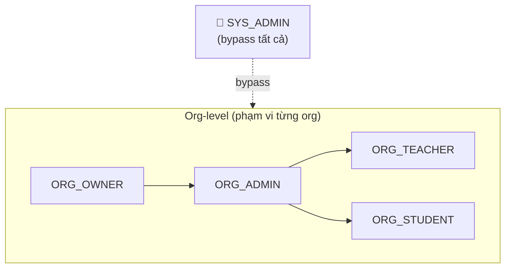

# Authorization Overview — Richter

## Principals & Roles

### System-level roles (từ JWT claims `role`)

| Role | Mô tả |
|------|-------|
| `ANONYMOUS` | Chưa xác thực, không có token |
| `USER` | Đã xác thực, `user_role = NORMAL` |
| `SYS_ADMIN` | Đã xác thực, `user_role = ADMIN`, bypass tất cả org-level checks |

### Organization-level roles (từ `organization_members.role`)

| Role | Mô tả |
|------|-------|
| `ORG_OWNER` | Người tạo org, quyền cao nhất trong org |
| `ORG_ADMIN` | Quản trị viên org |
| `ORG_TEACHER` | Giảng viên |
| `ORG_STUDENT` | Học viên |

Org-level roles chỉ có hiệu lực trong phạm vi org đó. `SYS_ADMIN` bypass tất cả org-level checks.

### Special context markers

| Ký hiệu | Ý nghĩa |
|---------|---------|
| `SELF` | Resource thuộc về chính user đang request (`claims.sub == resource.user_id`) |
| `–` | Không áp dụng |

---

## Role Hierarchy



Role cao hơn kế thừa tất cả quyền của role thấp hơn trong cùng org.

---

## Special Rules

### CreateOrganization → auto-add OWNER

Khi tạo org thành công, backend phải tự động thêm user vào `organization_members` với `role = OWNER, status = ACTIVE`. Đây là transactional operation:

```sql
BEGIN;
  INSERT INTO organizations (created_by, ...);
  INSERT INTO organization_members (organization_id, user_id=created_by, role='owner', status='active');
COMMIT;
```

`created_by` trong request phải bằng `claims.sub`. Không cho phép tạo org thay người khác.

### Role protection trong org

- `ORG_ADMIN` không thể thay đổi role/status của `ORG_OWNER`
- `ORG_OWNER` không thể tự hạ quyền của mình (tránh mất quyền)
- Để transfer ownership: promote user khác lên OWNER trước rồi mới hạ quyền

### Org member removal

- `ORG_ADMIN` không thể remove `ORG_OWNER`
- Chỉ `ORG_OWNER` hoặc `SYS_ADMIN` mới remove được owner

---

## Implementation Notes

### JWT Interceptor

Tất cả endpoints (trừ `Login`, `RefreshToken`, `Logout`) phải extract và validate access token từ header:

```
Authorization: Bearer <access_token>
```

Sau khi validate, lưu claims vào context:

```go
type contextKey string
const ClaimsKey contextKey = "jwt_claims"

ctx = context.WithValue(ctx, ClaimsKey, claims)
```

### Organization Context Resolution

Các endpoint cần kiểm tra org-level role thực hiện thêm một DB lookup:

```
(claims.sub, org_id từ request) → GetOrganizationMember → role
```

### Error Codes

| Tình huống | Connect code |
|-----------|-------------|
| Không có token hoặc token không hợp lệ | `CodeUnauthenticated` |
| Có token nhưng không đủ quyền | `CodePermissionDenied` |
| Resource không tồn tại (hoặc user không có quyền biết sự tồn tại) | `CodeNotFound` |
